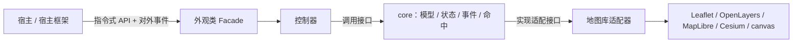
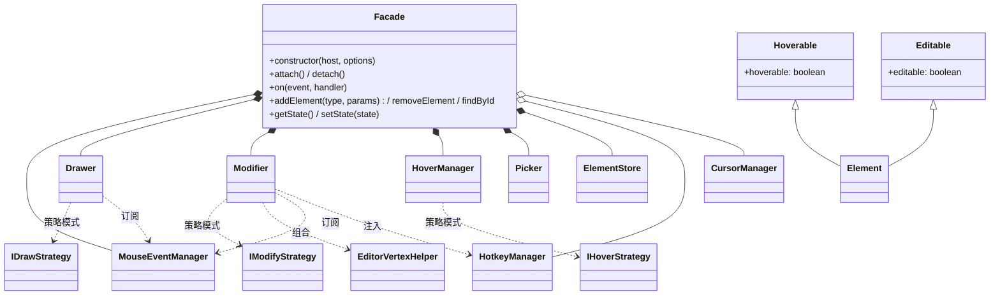

# 外观类、控制器装配与分层架构

## 1. 总体分层与类型关系

### 1.1 分层依赖



### 1.2 类型关系（类图）



图例说明：

- 实心菱形（`*--`）= 必选组合；空心菱形（`o--`）= 可选装配（HotkeyManager、CursorManager 可缺省）。
- 虚线（`..>`）= 依赖接口 / 订阅关系。
- `Element` 通过实现 `Hoverable / Editable` 标记接口获得“可悬停 / 可编辑”能力。

## 2. 外观类（Facade）

外观类是宿主与编辑器之间唯一的门面，行为上类比 maplibre 的 `map` 对象。

- **构造**：入参接收地图总对象——Cesium 的 `Viewer`、OpenLayers 的 `map`、Leaflet 的 `map`、或纯 canvas 上下文。可组装成结构体（如 `{ map, options }`）或参数列表直传。
- **可用性校验**：构造器必须检查总对象及其必要能力（如 `on/off`、容器存在）是否可用，不可用即抛带信息的错误，不进入半初始化状态。
- **装配**：直接 new 并持有全部子控制器（见 §3），并把 MouseEventManager、HotkeyManager（若装配）等输入源按需注入给 Drawer / Modifier；同时装配地图库适配器（自动识别或显式注入，见 adapters.md §0）。
- **统一事件出口**：所有对外阶段事件（绘制/编辑/悬停各阶段）由外观类实例统一派发（见 event-system.md）。
- **元素管理入口**：增删改查、空间查询等能力挂在外观类上（见 element-store.md）。
- **双入口**：画布交互与指令式调用两个入口都由外观类提供（见 canvas-interaction.md）。

## 3. 控制器清单与职责

| 控制器 | 职责 |
| --- | --- |
| MouseEventManager | 只做鼠标事件分发，粒度 leftdown/leftup/mousemove 等（见 mouse-event-manager.md） |
| Drawer | 绘制调度，策略模式（见 controllers.md） |
| Modifier | 变更调度，策略模式（见 controllers.md） |
| Hover / HoverManager | 悬停行为与样式反馈（见 canvas-interaction.md） |
| Picker | 命中拾取（见 picker.md） |
| HotkeyManager（可选） | 键盘状态与上下文注入，建议保留（见 hotkey-manager.md） |
| CursorManager（可选） | 指针图标与三级优先级（见 cursor-manager.md） |

## 4. 常用类名

统一推荐以下类名，便于宿主、二次开发者与插件约定理解：

| 角色 | 推荐类名 | 说明 |
| --- | --- | --- |
| 外观类 | `Facade`（别名 `EditorAppearance` / `Appearance`） | 对外唯一门面；不用 Map 前缀（可能封装非地图场景）；实例名可自定义（如 duck / hamburger——duck 是什么？你别管，可能是 cat） |
| 鼠标管家 | `MouseEventManager` | 输入 |
| 绘制器 | `Drawer` | 策略容器 |
| 变更器 | `Modifier` | 策略容器 |
| 悬停器 | `Hover` / `HoverManager` | 悬停行为 |
| 拾取器 | `Picker` | 命中 / 空间查询 |
| 热键 | `HotkeyManager` | 可选 |
| 光标 | `CursorManager` | 可选 |
| 顶点编辑管理 | `EditorVertexHelper` | 点编辑辅助图形 |
| 变换管理 | `TransformerManager` | 整体编辑：平移 / 旋转 / 缩放 |
| 吸附引擎 | `SnapManager` | 可选，吸附逻辑 |
| 选中管理 | `SelectionManager` | 可选，选中行为 |
| 仲裁器 | `StateMachine` / `StateArbiter` | 可选，竞态裁决（见 race-arbiter.md） |
| 元素仓库 | `ElementStore` | 数据层 |
| 坐标适配 | `<Engine>CoordinateAdapter`（如 `CesiumCoordinateAdapter`） | 适配层 |

外观类可暴露便捷 getter（如 `duck.mouse`、`duck.drawer`…），但如无必要可以不对外暴露——能封装在内部的就封装，保持门面最小。

## 5. 接口优先（interface first）

- 用 interface 约束“能力”，再让 class 实现并通过组合获得能力，而不是依赖继承链。
- 元素标记接口示例：

```ts
interface Hoverable { hoverable: boolean; }
interface Editable  { editable: boolean; }
```

- 策略接口示例：`IDrawStrategy`、`IModifyStrategy` 定义统一入口，具体策略各自实现。
- 控制器接口示例：`IMouseEventManager`、`IHotkeyManager`…，便于替换实现、单测 mock。

## 6. 组合优先于继承

- 默认优先用组合（持有 / 注入）扩展能力；仅在明确的“is-a”且结构稳定时用继承。
- 例如：编辑器通过持有策略对象组合编辑能力，而不是继承某个基类去堆逻辑。

## 7. 依赖方向（硬约束）

- 宿主 → 外观类 → 控制器 → core → adapters，依赖自上而下单向。
- core 与策略不得 import 任何地图库或 DOM。
- 适配器只依赖 core 的接口与类型。
- 外观类只依赖控制器接口与 core 类型，不依赖具体地图库实现。

## 8. 代码组织建议

- 目录：core 下按 `model/ state/ events/ coords/ hit-test/` 组织；每个适配器一个目录。
- 命名：公开类型与类用 PascalCase，方法用 camelCase；适配器统一 `XxxMapAdapter`。
- 公开 API 必须写 JSDoc 或 TSDoc（生成声明文件与 IDE 提示的基础）。
