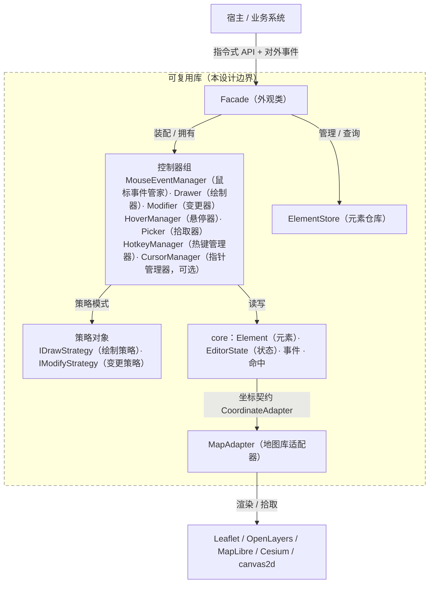
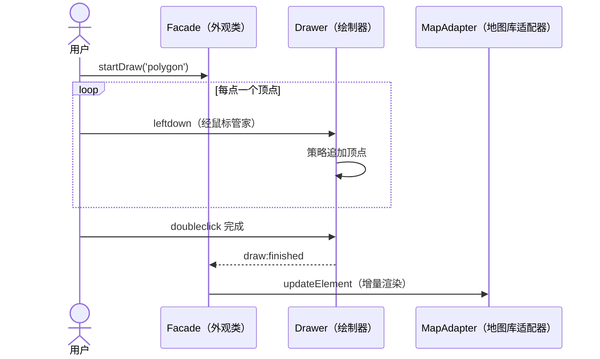
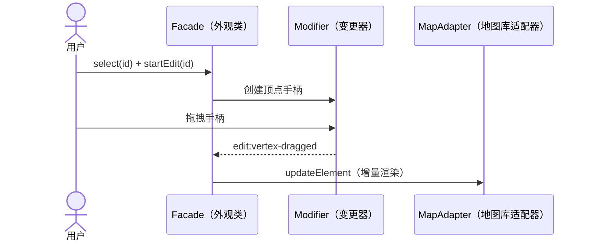

前端通用交互式几何编辑器：设计系列导读

# 前端通用交互式几何编辑器：设计系列导读

## 1. 为什么写这套东西

做前端的人大多碰过“在地图上画点什么”的需求。画个点、连条线、圈一块区域，看起来不难，可真要把它做成**能被业务系统集成、能被别人二次开发**的编辑器，市面上能找到的工具却大多差着一口气：

- 有的和一套**界面深度绑定**——编辑器长在自己的面板里，业务想换皮、想内嵌，动不了；
- 有的只支持**单一地图库**——绑死 Leaflet 或 Cesium，换个场景就得重写；
- 有的把绘制、编辑、撤销、图层树全堆在一起，改一处崩一片，越用越不敢动。

它们缺的不是功能，而是一种**工程美学**：让一个编辑器像库一样被信任——边界清晰、依赖单向、可组合、可替换、可长期维护。

于是有了这套 skill（`geometry-interactive-editor`）和这一系列文章。它们其实在做两件事：

1. **提出适用场景**：交互式几何编辑器不止“地图”——二维画布、三维场景、任意 canvas 几何编辑，都是它的舞台；它应当能跨库、无 UI、纯指令式地存在；
2. **总结经验教训**：这是我多年开发编辑功能踩坑、重构、被“集成需求”逼出来的设计取舍。如果能帮到读者和广大相关从业者少走弯路，那是对我的一种荣耀。

系列里没有玄学，只有“为什么这么分、什么时候可以不做”。

## 2. 整体设计一览

先看一张“总图”，后续每篇都是对它的展开：

读图要点：

- **虚线框 = 本设计交付的“可复用库”边界**：宿主（上方）与地图库（下方）都在框外，库对它们只有两处接口——对外事件 / 指令式 API，以及坐标契约 / 渲染适配；
- **外观类 Facade 是唯一入口**：宿主只面对它；它装配一组控制器，其中热键、光标可选；
- **绘制器 / 变更器通过策略模式组合能力**，Element 经 `Hoverable / Editable` 标记获得“可悬停 / 可编辑”能力（图中未展开，见第 3、4 篇）；
- **适配器在最外层**：实现坐标换算，把 core 翻译成具体地图库的渲染——这就是“库无关”的边界所在。

## 3. 两个经典流程

先剧透两个“最小闭环”，感受一下宿主与库的交互长什么样（完整版见第 4、5 篇）。

**画一个多边形：**

**拖一个顶点：**

两处共有的味道：宿主只碰 Facade，绘制 / 编辑逻辑不直接碰地图库，渲染一律经适配器。

## 4. 系列篇目

| # | 标题 | 一句话 | 核心问题 |
| --- | --- | --- | --- |
| 1 | [入口的对象及其成员](part-1-facade.md) | Facade 的作用、控制器装配，Cesium / MapLibre 示例 | 宿主到底面对什么？ |
| 2 | [交互事件流](part-2-event-flow.md) | 鼠标事件管家、热键上下文、事件机制全局化 | 输入与事件怎么组织？ |
| 3 | [数据对象的设计](part-3-element-model.md) | 静态数据对象、无选中 / 悬停状态、快照 | 数据对象该长什么样？ |
| 4 | [绘制、悬停与编辑](part-4-draw-hover-modify.md) | 策略对象纵向设计 + 竞态横向仲裁 | 多模式怎么共存？ |
| 5 | [辅助元素的设计](part-5-editing-helpers.md) | 编辑辅助角色层带来的扩展性 | 手柄、变换器怎么长出来？ |
| 6 | [配套设施与工程化](part-6-misc.md) | 样式规范、多库适配、坐标、日志、光标、工程化 | 配套设施怎么定？ |
| 7 | [设计模式与原则](part-7-design-patterns.md) | 横扫全系列，收束成规律 | 这套设计背后的模式与原则？ |

## 5. 阅读顺序

1 → 2 → 3 → 4 → 5 → 6 → 7。每篇独立可读，但后者会引用前者的概念；每篇末尾附“何时该用 / 何时不必”——因为好的设计，也懂得在不需要的地方停手。

## 6. 图例约定

文中图均为 mermaid：

- `flowchart`：流程 / 数据流
- `sequenceDiagram`：时序
- `stateDiagram`：状态机

愿这套东西，能让某个深夜还在为“编辑器怎么被集成”发愁的同行，少一点纠结。
