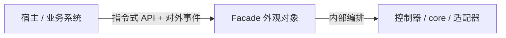
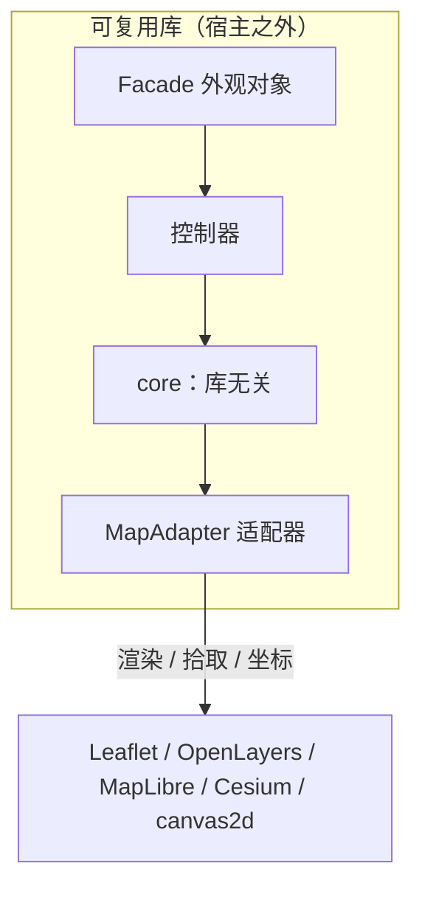

前端通用交互式几何编辑器的设计法则 1 - 入口的对象及其成员

# 本篇简述

本篇介绍外观对象（Facade）——宿主与编辑器之间的唯一门面：它的作用、它直接拥有哪些控制器、为什么这些控制器是外观类的成员，并以 Cesium 与 MapLibre 两个真实库为例跑一遍。

# 1. 宿主到底面对什么

先想一个问题：如果一个业务系统要集成“画多边形、拖顶点、撤销回退”这些能力，它应该面对什么？如果同一个能力要同时跑在 Cesium（三维场景）和 MapLibre（矢量瓦片）上，面对的东西还能一样吗？

本系列的答案很直接：**面对一个外观对象（Facade）**。它像 maplibre 的 `map` 对象一样，是宿主与编辑器之间唯一的门面。宿主不关心里面有多少控制器、状态存在哪、坐标怎么换算，它只做两件事：调用 Facade 上的方法、订阅 Facade 上的事件。



宿主侧的心智模型可以压缩成一句话：**“我调方法，我听事件，别的不关我事。”**

# 2. 外观对象的作用

## 2.1 构造与可用性校验

外观对象构造时接收一个 `host`——地图实例或 canvas 宿主。构造器要做的最重要一件事是**校验可用性**：宿主能力不全（没有 `on/off`、没有 canvas、拿不到尺寸），直接抛错，绝不进入半初始化状态。

```ts
class Facade {
  private readonly host: EditorHost;

  constructor(host: EditorHost, options: FacadeOptions) {
    assertHostUsable(host);        // 校验 on/off、canvas、尺寸
    this.host = host;
    this.adapter = options.adapter ?? resolveAdapterByHost(host); // 自动识别或显式注入
    this.logger = options.logger ?? new ConsoleLogger();
    // 装配控制器（见 §3）
    this.mouse = new MouseEventManager(host);
    this.drawer = new Drawer({ mouse: this.mouse, hotkeys: options.hotkeys ? new HotkeyManager(options.hotkeys) : undefined });
    this.modifier = new Modifier({ mouse: this.mouse, hotkeys: this.hotkeys });
    // ...
  }
}

function assertHostUsable(host: EditorHost): void {
  if (!host || typeof host.on !== 'function' || !host.canvas) {
    throw new Error('Facade: 宿主不可用，缺少 on/off 或 canvas');
  }
  if (!(host.width > 0 && host.height > 0)) {
    throw new Error('Facade: 宿主尺寸无效');
  }
}
```

## 2.2 库无关的边界

外观对象只依赖**控制器接口**与 **core 类型**，不依赖任何具体地图库。真正接触地图库的是最外层的适配器（`MapAdapter`）。也就是说，“库无关”不是一句口号，而是一条硬边界：core 永远不知道 Leaflet、Cesium 的存在，是适配器负责翻译。



# 3. 它的“大将”：为什么这些是外观类的成员

外观对象直接拥有下面这批控制器。它们**共享同一个输入源、同一个事件出口、同一个仲裁器**——把这些绑定关系放在外观类里，是让“谁该听谁的”保持确定性的最直接方式。

| 控制器 | 职责 | 为什么是成员 |
| --- | --- | --- |
| MouseEventManager（鼠标事件管家） | 鼠标事件分发 | 输入的唯一收口，所有消费者都经它，必须由外观类统一装配 |
| Drawer（绘制器） | 绘制策略容器 | 需要订阅输入、注入热键，装配关系由外观类建立 |
| Modifier（变更器） | 变更策略容器 | 与 Drawer 共享输入源，且联动辅助图形 |
| HoverManager（悬停器） | 悬停行为 | 与绘制 / 编辑竞争同一套鼠标，必须受仲裁器管 |
| Picker（拾取器） | 命中检测 | 被 Hover / Drawer / Modifier 共用，不宜散落 |
| HotkeyManager（热键管理器） | 键盘状态 | 作为“上下文”注入各策略对象（见第 2 篇） |
| CursorManager（指针管理器） | 光标图标 | 随交互阶段变化，与输入强相关 |
| ElementStore（元素仓库） | 元素管理 / 统计 | 数据访问的唯一入口，挂在门面上最自然 |

```ts
interface Facade {
  readonly mouse: MouseEventManager;
  readonly drawer: Drawer;
  readonly modifier: Modifier;
  readonly hoverer: HoverManager;
  readonly picker: Picker;
  readonly hotkeys?: HotkeyManager;    // 可选
  readonly cursor?: CursorManager;     // 可选
  readonly store: ElementStore;
}
```

热键、光标是可选的（空心装配），其余是必选。为什么它们要待在门内而不是散落各处？因为**装配关系**本身就是设计：谁订阅谁、谁注入谁、谁先问仲裁器，这些如果让业务方自己拼，迟早拼出不一致。

# 4. 换库试试：Cesium 与 MapLibre

同一段宿主代码，只换适配器就能跑在另一套地图库上——这是“外观对象 + 适配器”最直观的证明。

> 小注：`duck` 是什么？你别管，你封装什么它是什么——也可能是 `cat`。

## 4.1 Cesium 场景（三维）

```ts
import * as Cesium from 'cesium';
import { Facade, CesiumMapAdapter } from '@scope/editor';

const viewer = new Cesium.Viewer('cesiumContainer');
const duck = new Facade(viewer, { adapter: new CesiumMapAdapter() });

// 指令式：加一个图标 + 文字的 marker
duck.addElement('marker', {
  coord: [116.39, 39.9],
  icon: 'data:image/svg+xml,...',
  text: '北京',
});

// 指令式：开始画多边形，并监听完成
duck.on('draw:finished', ({ geometry }) => {
  console.log('画完了', geometry);
  duck.select(duck.findByIdOfGeometry(geometry)!.id);
});
duck.startDraw('polygon');

// 精确编辑：把某个顶点的 y 坐标改成 42
duck.setHandleValue(id, { kind: 'vertex', index: 2 }, 42);
```

## 4.2 MapLibre 场景（矢量瓦片）

```ts
import maplibregl from 'maplibre-gl';
import { Facade, MapLibreMapAdapter } from '@scope/editor';

const map = new maplibregl.Map({ container: 'map', style: 'https://demo.tileserver.com/style.json' });
const duck = new Facade(map, { adapter: new MapLibreMapAdapter() });

duck.addElement('circle', { center: [116.39, 39.9], radius: 500, segments: 64 });
duck.on('edit:vertex-dragged', ({ elementId }) => console.log('顶点变了', elementId));
duck.select('some-id');
```

注意两处代码几乎相同：构造传入 `host` 与对应的适配器，其余 API（`addElement` / `startDraw` / `setHandleValue` / `on`）完全一致。这就是门面存在的意义。

# 5. 对外 API 分组

把外观对象的公开方法按用途分组，方便记忆：

| 分组 | 方法 |
| --- | --- |
| 生命周期 | `attach()` / `detach()` |
| 事件 | `on` / `once` / `off` |
| 状态快照 | `getState()` / `setState(state)` |
| 元素管理 | `addElement(type, params)` / `removeElement` / `updateElement` / `findById` / `search` |
| 绘制 / 编辑 | `startDraw(type, options?)` / `cancelDraw()` / `startEdit(id)` / `cancelEdit()` |
| 选中 / 悬停 | `select(id)` / `deselect()` / `hover(id)` / `unhover()` |
| 精确编辑 | `setHandleValue(elementId, handle, value)` |
| 日志 | `logger` |

# 6. 小结与“何时不必”

外观对象解决的是“**宿主和库之间的那扇门**”。它把装配、输入注入、事件出口、双入口全部收口到一个对象上，让“换地图库”退化成“换适配器”。

**何时不必**：如果你只是在自己项目里画几个固定图形，不需要这扇门——直接用 Leaflet 的 API 就好。一旦目标是“被集成、跨库、长期演进”，先把门立起来，后面每一篇都在门的里面做文章。
