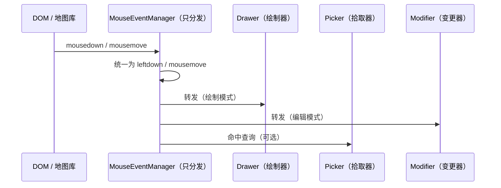
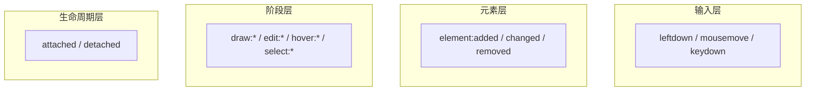

前端通用交互式几何编辑器的设计法则 2 - 交互事件流

# 本篇简述

本篇讲输入与事件如何被组织：为什么鼠标事件管家只做分发、为什么键盘热键被设计成可注入的上下文类（含 3D 取点模式 PickMode），以及事件机制如何全局统一。

# 1. 为什么一开始只是“简单的鼠标事件分发”

很多编辑器会把业务判断直接写进鼠标回调里：`onClick` 里判断“是不是绘制模式、命中了什么、要不要进入编辑”……回调越写越长，最后没法测试、没法替换。

本系列的做法相反：先有一个只做**分发**的鼠标事件管家（`MouseEventManager`）。它不问“你拿来干嘛”，只管“收到什么、发给谁”。

## 1.1 事件粒度

| 事件 | 说明 | 使用频率 |
| --- | --- | --- |
| `leftdown` | 左键按下 | 主 |
| `leftup` | 左键抬起 | 主 |
| `mousemove` | 移动 | 主 |
| `leftclick` | 单击 | 次 |
| `doubleclick` | 双击 | 次 |
| `middledown` / `middleup` | 中键 | 次 |

```ts
interface MouseEventManager {
  on(
    e: 'leftdown' | 'leftup' | 'mousemove' | 'leftclick' | 'doubleclick' | 'middledown' | 'middleup',
    handler: (evt: MouseInputEvent) => void
  ): () => void;      // 返回退订函数
  attach(): void;
  detach(): void;
}

interface MouseInputEvent {
  originalEvent: MouseEvent;       // 原生事件
  screen: ScreenCoord;             // 屏幕坐标
  picked?: PickResult;             // 经拾取器命中后回填
}
```

## 1.2 事件从哪来、到哪去

把“事件来源”与“事件消费”拆开，是这一层设计的核心：



谁订阅它、怎么编排，由外观类负责。鼠标事件管家自己**不做任何业务判断**，这是它可替换、可测试的前提。

# 2. 为什么键盘热键被设计成“上下文类”

鼠标事件好理解，键盘却有点特殊：同一个按键在不同场景下含义不同——绘制时 Backspace 删点、编辑时删除选中顶点；Shift 在画线时是“吸附 / 锁角度”，在 3D 里还可能是“切换取点轴 / 平面”。

所以键盘不设计成“分发给所有人”的事件流，而是设计成一个**可注入的上下文对象**（`HotkeyManager`）：谁在交互，谁就订阅 / 查询它。

```ts
interface HotkeyManager {
  isDown(code: string): boolean;                  // 查询当前是否按住
  onDown(code: string, handler: () => void): () => void;
  onUp(code: string, handler: () => void): () => void;
  press(e: KeyboardEvent): void;                  // 适配层注入原始键盘事件
}

interface HotkeyOptions {
  target?: HTMLElement;          // 监听目标，缺省 window
  enabled?: boolean;
}
```

## 2.1 PickMode：3D 的取点歧义

一个典型场景是 3D 编辑的**取点歧义**：拖顶点时，单看 `leftdown / leftup` 无法区分这次更新是“按射线与几何交点取点”、“按某个平面取点”还是“按某个轴取点”。策略对象需要一个明确的**取点模式（PickMode）** 状态输入口，而它正是由热键（或宿主指令式调用）驱动：

```ts
type PickCallback = (screen: ScreenCoord, state: EditorState) => WorldCoord | null;

// 可辨识联合：kind 始终是字面量，可直接收窄
type PickMode =
  | { kind: 'free' }                          // 射线与几何 / 参考面交点
  | { kind: 'plane'; plane: PlaneInfo }       // 固定平面取点
  | { kind: 'axis'; axis: AxisInfo }          // 固定轴向取点
  | { kind: 'custom'; pickCallback: PickCallback };  // 自定义：回调随取点模式携带
```

## 2.2 扩展点：自定义取点

内置三种之外，直接以**回调**扩展——取点函数随 `PickMode` 对象一起传递，无需全局注册：

```ts
const customPick: PickMode = {
  kind: 'custom',
  pickCallback: (screen, state) => projectToMySurface(screen, state),
};

// 策略对象在 mousemove 中按 kind 收窄处理
switch (this.pickMode.kind) {
  case 'free':   return this.coords.screenToWorld(evt.screen, { pickElevation: true });
  case 'plane':  return rayPlaneIntersect(evt.screen, this.pickMode.plane);
  case 'axis':   return projectToAxis(evt.screen, this.pickMode.axis);
  case 'custom': return this.pickMode.pickCallback(evt.screen, this.editorState);
}
```

回调内联的优点是：判别字段始终是字面量 `'custom'`、无需全局可变注册表、可随用随传；代价是函数不可序列化，但取点模式本就是瞬时输入、不进快照，可接受。

把热键做成上下文而不是广播，本质是让“**哪个策略在消费键盘**”这件事由仲裁决定（见第 4 篇），而不是由键盘事件自己决定。

# 3. 事件机制的全局使用

## 3.1 事件分层与目录

库内部与对外通信，统一走一套事件机制（默认 EventEmitter3 风格，也可自封装）。事件分四层：



所有事件名与载荷在**事件目录**里统一登记，防止漂移：

| 事件 | 载荷（节选） |
| --- | --- |
| `draw:started` / `draw:finished` / `draw:cancelled` | `{ drawType }` / `{ geometry }` / `{ branch? }` |
| `draw:branch-triggered` | `{ branch, draft, allowed }` |
| `edit:started` / `edit:ended` / `edit:switched` | `{ elementId }` 等 |
| `edit:vertex-dragged` / `edit:transform-dragged` | `{ elementId, ... }` |
| `edit:handle-selected` | `{ elementId, handle, value }` |
| `hover:enter` / `hover:leave` | `{ elementId, hitPoint }` |
| `select:changed` / `select:cancel-rejected` | `{ elementId }` / `{ reason }` |
| `element:added` / `element:changed` / `element:removed` | `{ element }` 等 |
| `change` | `EditorState` |

## 3.2 统一出口与触发时机

- 对外通信一律**经外观类实例派发**，事件载荷用 core 类型，不带地图库类型；
- 事件在“**状态已更新、渲染尚未发生**”时派发，保证订阅方读到一致状态；
- 一次逻辑操作只派发一个最终事件（拖拽结束只发一次 `element:changed`），不刷中间态；
- handler 抛错不得中断派发链：统一捕获并 `console.error`。

> 注：`duck` 是什么？你别管，你封装什么它是什么——也可能是 `cat`。

```ts
duck.on('draw:branch-triggered', ({ branch, allowed }) => {
  // UI 提示“多边形自交了”，allowed 决定是否允许落点
});
duck.on('edit:handle-selected', ({ elementId, handle, value }) => {
  // 把数值输入框绑定到该顶点 / 中点
  input.value = String(value);
});
```

# 4. 小结与“何时不必”

如果你的交互只有一种模式（比如只画不编辑），鼠标分发 + 热键上下文这套可能显得多余。但只要出现“**多模式、多消费者、键盘影响几何**”三者之一，这套“输入收口 + 上下文注入 + 事件目录”的组织方式就值得抄——它让交互的**归属**从“事件顺序的巧合”变成“结构上的确定”。
