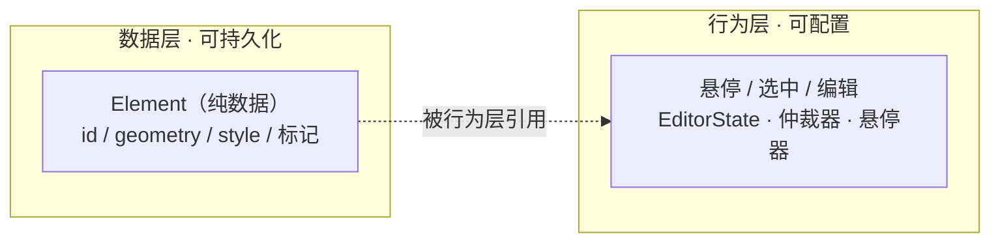
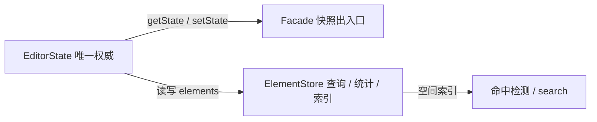

前端通用交互式几何编辑器的设计法则 3 - 数据对象的设计

# 本篇简述

本篇讲元素（Element）为何是一个无交互状态的静态数据对象，快照模型如何让撤销 / 重做归宿主，并介绍数据层三件套（Element / EditorState / ElementStore）与统一创建、序列化约定。

# 1. 元素是一张“静止的照片”

很多编辑器把“选中了没有、悬停着没有、是不是在编辑”这些状态直接挂到元素对象上。本系列的立场相反：**元素是纯数据对象，自身不具备选中、悬停、编辑等任何交互状态**。它是模型层的一张“静止的照片”，行为状态活在编辑器一侧。

## 1.1 Element 接口与类型

```ts
type ElementType =
  | 'marker'      // 图标 + 文字
  | 'label'       // 仅文字
  | 'billboard'   // 仅图标
  | 'polyline'    // 单线
  | 'polygon'     // 单面，可带洞
  | 'circle'      // 圆心 + 半径（底层仍是多边形）
  | 'mesh'        // 纯三角形几何输入
  | 'prism'       // 棱柱（多部件）
  | 'cylinder';   // 圆柱（多部件）

interface Element {
  readonly id: string;
  readonly name: string;
  readonly type: ElementType;
  geometry: Geometry | Geometry[];        // 多部件类型可为数组
  style?: ElementStyle;                   // 元素自身基础样式（每个实例可不同）
  hoverStyle?: ElementStyle;              // 悬停反馈（实例级，可选）
  selectedStyle?: ElementStyle;           // 选中反馈（实例级，可选）
  editingStyle?: ElementStyle;            // 编辑反馈（实例级，可选）
  readonly hoverable: boolean;            // 标记：可被悬停器接管
  readonly editable: boolean;             // 标记：可被变更器接管

  update(partial: { geometry?; style?; hoverStyle?; selectedStyle?; editingStyle?; name? }): Element;   // 返回新对象
  getStyle(): ElementStyle | undefined;                                      // 获取基础样式
  getStyleFor(state: 'hover' | 'selected' | 'editing'): ElementStyle | undefined;  // 获取指定反馈样式
  snapshot(): ElementSnapshot;            // 深拷贝快照
}
```

`hoverable / editable` 是**标记**而非状态：它决定“悬停器 / 变更器能不能碰这个元素”，而不是“这个元素此刻悬停 / 编辑中”。后者是行为，活在仲裁器与交互层。

## 1.2 为什么静态：数据与行为分离



好处很直接：

- 元素可以自由进进出出、深拷贝、持久化，不会因为带着一堆 UI 状态而出错；
- 悬停 / 选中 / 编辑是**可配置的行为**：不配样式，画布上的元素就毫无反应；
- 快照契约成立——`getState()` / `setState()` 往返无副作用。

# 2. 为什么这么设计：状态即数据

一句话：**状态即数据，历史归宿主**。

- 库不维护命令栈 / 撤销历史，只提供快照出入口；
- 撤销 / 重做由宿主实现：动作前存快照，撤销 / 重做时整体回放。

## 2.1 快照契约

```ts
interface EditorState {
  elements: Element[];                 // 唯一权威
  activeElementId: string | null;      // 当前选中 / 编辑
  mode: 'view' | 'draw' | 'edit';
  drawType?: ElementType;
}

// 库只提供两个方法：
// duck 是什么？你别管，你封装什么它是什么——也可能是 cat
duck.getState(): EditorState;          // 深拷贝导出
duck.setState(next: EditorState): void; // 整体替换，派发一次 change
```

## 2.2 宿主侧 undo / redo

```ts
// 宿主实现（示意）
const undoStack: EditorState[] = [];
const redoStack: EditorState[] = [];

function beforeMilestone() { undoStack.push(duck.getState()); redoStack.length = 0; }
function undo() { const prev = undoStack.pop(); if (prev) { redoStack.push(duck.getState()); duck.setState(prev); } }
function redo() { const next = redoStack.pop(); if (next) { undoStack.push(duck.getState()); duck.setState(next); } }
```

代价是宿主多存几份数据，换来的是库更薄、无历史状态、核心逻辑可纯函数化测试。

# 3. 数据层三件套：Element / EditorState / ElementStore

三个角色各司其职：Element 是数据对象，EditorState 是唯一权威容器，ElementStore 是查询 / 统计接口。

## 3.1 外观类统一创建

`ElementFactory` 是内部实现、**不对外导出**——对外统一经外观类 `addElement(type, params)` 创建并入库，保持外观对象的集中性：

```ts
duck.addElement('polygon', { rings, holes });
duck.addElement('marker',  { coord, icon, text });
duck.addElement('circle',  { center, radius, segments: 64 });
duck.addElement('prism',   { base, height });
duck.addElement('mesh',    { positions, indices });
```

## 3.2 状态与仓库

为什么权威数据用**数组**而不是 Map / Set？因为快照要深拷贝、要可 JSON 序列化、要保持插入顺序（z 层级 / 绘制顺序）；O(1) 查找的优势交给仓库用内部索引补。

```ts
interface ElementStore {
  add(element: Element): void;
  remove(id: string): boolean;
  update(id: string, partial: Partial<Element>): Element;
  get(id: string): Element | undefined;

  findById(id: string): Element | undefined;
  search(geo: QueryGeometry, opts?: SearchOptions): Element[];   // 点 / 线 / 面空间查询
  each(fn: (e: Element) => void): void;
  filter(predicate: (e: Element) => boolean): Element[];
  [Symbol.iterator](): Iterator<Element>;

  count(): number;                 // 总数（缓存）
  bounds(): Bounds | null;         // 总范围（缓存，增量维护）
}
```



顺带一提**序列化**：库只给快照（`getState()` / `element.snapshot()`），不内置任何格式的序列化——要转 GeoJSON 由调用方自己做，比如把 `elements` 映射成 `FeatureCollection`。样式规范细节也不在此篇展开（见第 6 篇）。

# 4. 小结与“何时不必”

元素的“静态化”是整套快照模型的地基。如果你根本不需要撤销 / 持久化 / 跨库复用，元素带点状态也无妨；一旦要“库可长期演进”，把**数据与行为分开**是成本最低的一步。注意：样式是数据的一部分（可序列化、可快照），而“悬停中 / 选中中”是行为——这条分界线值得在代码评审时反复强调。
