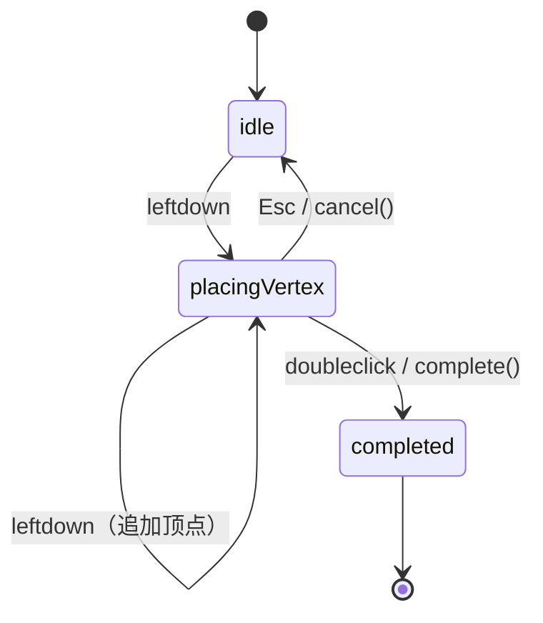
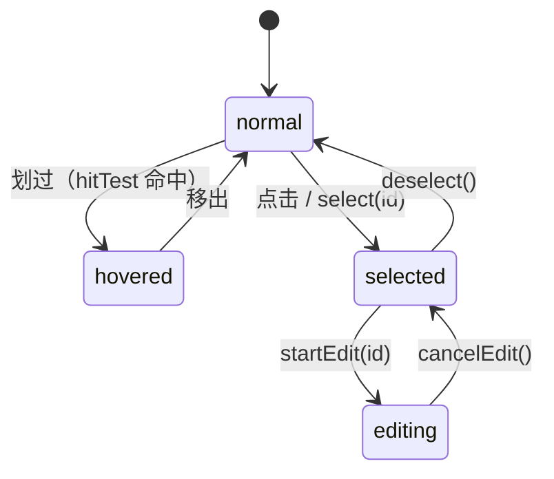
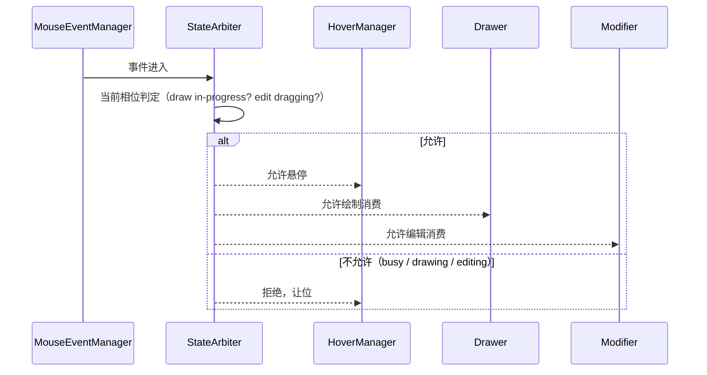

前端通用交互式几何编辑器的设计法则 4 - 绘制、悬停与编辑

# 本篇简述

本篇是重头戏：纵向看策略对象与它内部的状态机（同一事件在不同状态做不同的事），横向看绘制 / 编辑 / 悬停的竞态如何靠仲裁器解决，以及样式反馈的配置。

这是全系列的重头戏。先纵向看“单个策略对象怎么设计”，再横向看“多个消费者怎么共存”。

# 1. 纵向：策略对象的设计

## 1.1 策略接口

绘制器（`Drawer`）与变更器（`Modifier`）是**策略容器**：它们只做“订阅输入 → 路由给当前策略 → 收结果 → 更新状态 / 派发事件”，不感知各策略内部的子状态。真正干活的是策略对象。

```ts
interface IDrawStrategy {
  readonly name: string;
  onLeftDown?(evt: MouseInputEvent): void;
  onLeftUp?(evt: MouseInputEvent): void;
  onMouseMove?(evt: MouseInputEvent): void;
  onDoubleClick?(evt: MouseInputEvent): void;
  onHotkey(h: HotkeyManager): void;                 // 上下文注入
  onElementUpdated?(element: Element, prev: Element): void;  // 指令式更新同步
  complete(): void;
  cancel(): void;
}

interface IModifyStrategy {
  readonly name: string;
  onLeftDown?(evt: MouseInputEvent): void;
  onMouseMove?(evt: MouseInputEvent): void;
  onHotkey(h: HotkeyManager): void;
  apply(motion: EditMotion): void;                  // 消费辅助图形的运动量
  cancel(): void;
}
```

## 1.2 策略内部的状态机

每个策略内部用**状态模式**管理自己的子状态机——不同状态下，同样的事件做不同的事：



## 1.3 完整绘制策略代码

以多边形绘制策略为例，看“同一个 `onLeftDown` 在不同状态下干什么”，以及热键如何影响行为：

```ts
class PolygonDrawStrategy implements IDrawStrategy {
  private state: 'idle' | 'placingVertex' = 'idle';
  private draft: Coord[] = [];
  private constrainAngle = false;

  onLeftDown(evt: MouseInputEvent): void {
    if (this.state === 'idle') {
      this.state = 'placingVertex';              // idle：第一次点击才开始
      this.draft = [evt.picked!.point];
      return;
    }
    let p = evt.picked!.point;
    if (this.constrainAngle && this.draft.length) p = snapAngle(p, this.draft.at(-1)!);  // Shift 锁角度
    const next = [...this.draft, p];
    if (isSelfIntersecting(next)) {
      this.emit('draw:branch-triggered', { branch: 'self-intersection', allowed: false });
      return;                                    // 拒绝自交落点，回到上一状态
    }
    this.draft = next;                           // 追加顶点
    this.emit('draw:vertex-added', { point: p });
  }

  onDoubleClick(): void { this.complete(); }

  onHotkey(h: HotkeyManager): void {
    this.constrainAngle = h.isDown('ShiftLeft'); // 按住 Shift 锁角度
    if (h.isDown('Backspace')) { this.draft.pop(); this.emit('draw:vertex-removed', { index: this.draft.length }); }
    if (h.isDown('Escape')) this.cancel();
  }

  complete(): void {
    this.state = 'completed';
    this.emit('draw:finished', { geometry: closeRing(this.draft) });
  }
  cancel(): void { this.state = 'idle'; this.draft = []; this.emit('draw:cancelled'); }
}
```

## 1.4 编辑策略：idle 与 dragging

编辑策略同理，`idle`（可悬停其它元素、点击切换编辑目标）与 `dragging`（正拖着手柄，禁悬停禁切换）消费的是辅助图形上传的运动量：

```ts
class VertexEditStrategy implements IModifyStrategy {
  private state: 'idle' | 'dragging' = 'idle';

  onLeftDown(evt: MouseInputEvent): void {
    if (this.state === 'idle' && evt.picked?.handle) this.state = 'dragging';  // 抓住手柄
  }
  onMouseMove(evt: MouseInputEvent): void {
    if (this.state !== 'dragging') return;
    const picked = this.pickMode.resolve(evt.screen, this.editorState);        // 按 PickMode 取点
    this.apply({ kind: 'vertex', elementId, handle, from, to: picked, pickMode });
  }
  onLeftUp(): void { this.state = 'idle'; }

  apply(motion: EditMotion): void {
    // 画布拖拽与 setHandleValue 都汇到这里：更新顶点 → 同步辅助图形 → 派发事件
    this.updateVertex(motion.elementId, motion.handle.index, motion.to);
  }
}
```

关键设计：画布交互和指令式（`duck.setHandleValue`）两条入口，最终交汇在**同一个 `apply(motion)`**——保证两条路结果一致，这是全系列反复强调的点。

# 2. 样式管理：悬停 / 选中是“行为”

悬停与选中不写在元素上，而是作为**可配置的行为**由外观类管理，反馈靠样式：

> 注：`duck` 是什么？你别管，你封装什么它是什么——也可能是 `cat`。

```ts
// 外观类的 styles 只是【全局默认】反馈样式（fallback）
const duck = new Facade(host, {
  styles: {
    hoverStyle:    { line: { color: '#36f', opacity: 1, width: 3 } },
    selectedStyle: { line: { color: '#ff8c00', opacity: 1, width: 3 }, fill: { color: '#ff8c00', opacity: 0.3 } },
    editingStyle:  { line: { color: '#0a0', opacity: 1, width: 3 } },
  },
});

// 样式是【实例级】的：每个元素可各自覆盖，未配置时回落全局默认
duck.addElement('polygon', {
  rings,
  style:         { line: { color: '#888' } },
  selectedStyle: { line: { color: '#f80', width: 4 } },
});
```

解析优先级：**元素实例反馈样式 > 外观类默认反馈样式 > 元素自身基础样式**（`element.selectedStyle ?? 默认.selectedStyle ?? element.style`），都未配置则无反馈。

样式也可以在**绘制时指定**——`startDraw` 携带的样式会落到新元素上：

```ts
duck.startDraw('polygon', {
  allowSelfIntersect: false,
  style:         { line: { color: '#36f', opacity: 1, width: 2 } },
  selectedStyle: { line: { color: '#ff8c00', opacity: 1, width: 3 } },
});
```

规则：

- 选中的元素悬停时**不再触发悬停**（避免样式打架）；
- 不配样式，元素就毫无反应；
- 悬停器的职责是“划过时命中 → 应用 / 清除 hoverStyle → 派发 `hover:enter / leave`”。

样式是“行为反馈”，**取消时恢复原样式**，且恢复与竞态仲裁保持一致：

- 进入悬停 / 选中 / 编辑时应用对应样式，取消该行为时**回退到下一级样式或元素原样式**（退出编辑 → 恢复选中样式；取消选中 → 恢复悬停或原样式；取消悬停 → 恢复原样式）；
- 选中的元素不进入悬停，所以对它 `unhover()` **无效果**；编辑态被仲裁器拒绝的 `deselect()` 也不恢复样式——**被拒绝的取消不改变样式**。



# 3. 横向：竞态机制怎么解决

鼠标只有一套，消费者有好几个。规则先定死（设计评审的对照基准）：

| 场景 | 悬停 | 点击行为 |
| --- | --- | --- |
| 空闲 | 可悬停 | 悬停 → 点击进入编辑（若可编辑） |
| 绘制空闲 | 可悬停 | 悬停 → 点击切到编辑 |
| 绘制进行中 | 禁止 | 仅消费当前草稿 |
| 编辑空闲 | 可悬停 | 点击切换编辑元素 |
| 编辑进行中 | 禁止 | 仅消费当前编辑操作 |

## 3.1 仲裁器实现

轻量场景一组条件判断即可；复杂场景做成外观类的私有成员——状态仲裁器（`StateArbiter`）：

```ts
type EditorPhase =
  | { kind: 'idle' }
  | { kind: 'draw'; sub: 'idle' | 'in-progress' }
  | { kind: 'edit'; sub: 'idle' | 'in-progress' };

type AllowResult =
  | { ok: true }
  | { ok: false; reason: 'busy' | 'drawing' | 'editing' };

interface StateArbiter {
  request(consumer: 'hover' | 'select' | 'draw' | 'edit'): AllowResult; // 申请消费，校验互斥
  enter(phase: EditorPhase): void;                                      // 状态转移
  onTransition(cb: (from: EditorPhase, to: EditorPhase) => void): () => void;
}
```

所有控制器的输入**先问仲裁器**，拿到允许才继续，否则让位；拾取器只出命中结果（`elementId | null`），不裁决。

## 3.2 仲裁时序



一个容易踩的细节：取消选中时若处于编辑态，应**拒绝取消**（`{ ok: false, reason: 'editing' }`）——必须先 `cancelEdit()` 再取消选中，这个拒绝逻辑由仲裁器完成。

# 4. 小结与“何时不必”

纵向的“容器 + 策略状态机”和横向的“仲裁器”解决的是同一件事：**让交互的归属确定**。只有单一模式时都可以省；一旦绘制 / 编辑 / 悬停并存，这套结构是让它们不互相踩踏的最小成本方案。样式反馈与悬停 / 选中行为绑定，是“行为可配置”最直观的体现。
