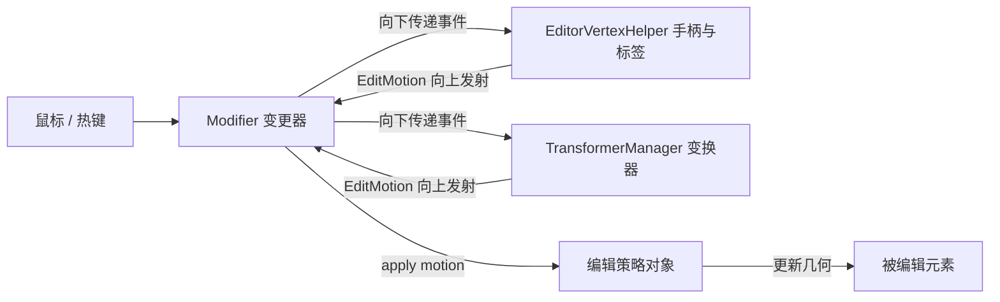
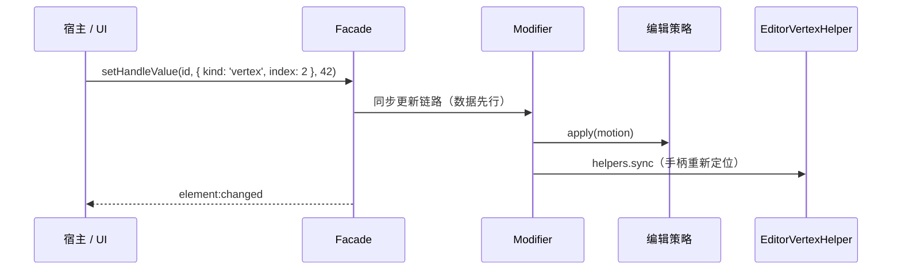

前端通用交互式几何编辑器的设计法则 5 - 辅助元素的设计

# 本篇简述

本篇讲编辑态里长出来的辅助图形（手柄、标签、变换器）如何通过抽离“编辑辅助角色层”获得扩展性，包括自持编号带来的程序化精确编辑。

# 1. 编辑态里“长出来”的东西

进入编辑后，被编辑元素之外还会出现一批服务于编辑的图形：顶点手柄、中点手柄、圆心手柄、距离标签、半径线、垂线、轴向辅助线……它们**只存在于编辑态**，退出编辑即销毁。

## 1.1 辅助图形清单

| 图形 | 可交互 | 用途 |
| --- | --- | --- |
| 顶点手柄 | 是 | 拖拽移动顶点 |
| 中点手柄 | 是 | 在线段中点加顶点 / 拖拽 |
| 圆心手柄 | 是 | 拖拽圆心（圆 / 弧） |
| 距离标签 | 否 | 显示边长 / 半径等测量值 |
| 半径线 | 否 | 表示圆 / 弧半径方向 |
| 垂线 | 否 | 显示垂足 / 正交约束 |
| 轴向辅助线 | 否 | 表示当前取点平面 / 轴向（配合 PickMode） |

这批东西如果不能有序地“长出来”，编辑器很快会变成一锅粥：手柄逻辑、标签绘制、变换器代码全堆在编辑策略里，加一种几何就动一次策略。

本系列的做法是**抽离一层“编辑辅助角色”**：编辑策略只负责几何算法，辅助图形只负责表现与拾取，中间用一条明确的消息流连接。

# 2. 角色划分：轻量、无状态、可寻址

辅助图形比被编辑元素更轻：**不进元素仓库、不携带业务数据**，只持有定位所需的几何量（坐标、方向、轴向），由 `EditorVertexHelper`（点编辑）统一创建与回收。

## 2.1 两条消息流



- **输入流**：Modifier 把鼠标事件向下传给辅助图形，并消费热键状态；
- **输出流**：手柄拖拽 → 发 `edit:vertex-dragging / dragged` → Modifier 把运动量交给当前编辑策略（`apply(motion)`），策略算几何，更新元素。

辅助图形**不感知几何算法**，策略**不感知图形表现**——这就是扩展性的来源：加一种手柄，不动策略；换一种几何算法，不动图形。

## 2.2 角色层接口

```ts
interface EditorVertexHelper {
  attach(element: Element): void;      // 进入编辑：按几何生成手柄 / 标签
  sync(element: Element): void;        // 元素更新后重新定位（同步链路）
  detach(): void;                      // 退出编辑：统一销毁
  on(evt: 'handle-selected' | 'drag', handler: (m: EditMotion) => void): () => void;
}
```

# 3. 自持编号：把手柄变成可寻址的

每个可交互手柄持有稳定编号（`HandleId`），使外部可以**程序化精确编辑**——这是“面向库使用者”的关键点。

## 3.1 HandleId 与 setHandleValue

```ts
type HandleId =
  | { kind: 'vertex'; index: number }
  | { kind: 'midpoint'; index: number }
  | { kind: 'center' }
  | { kind: 'transform'; transformer: 'translate' | 'rotate' | 'scale' };

duck.setHandleValue(elementId, { kind: 'vertex', index: 2 }, 42);
// duck 是什么？你别管，你封装什么它是什么——也可能是 cat
```

点击手柄进入“二级编辑（精确编辑）”状态时，派发 `edit:handle-selected`，宿主据此把数值输入框绑定到该辅助量；用户改数字 → `setHandleValue` 回写。精确更新与画布拖拽最终归结为同一个运动量交给策略，两条入口结果一致。

## 3.2 EditMotion：可辨识联合

每种手柄的“运动量”字段固定且互斥，先分别定义，再按类型名联合，便于收窄与复用：

```ts
type VertexMotion = {
  kind: 'vertex';
  elementId: string;
  handle: { kind: 'vertex'; index: number };
  from: WorldCoord;
  to: WorldCoord;
  pickMode: PickMode;
};

type MidpointMotion = {
  kind: 'midpoint';
  elementId: string;
  handle: { kind: 'midpoint'; index: number };
  from: WorldCoord;
  to: WorldCoord;
  pickMode: PickMode;
};

type CenterMotion = {
  kind: 'center';
  elementId: string;
  handle: { kind: 'center' };
  from: WorldCoord;
  to: WorldCoord;
  pickMode: PickMode;
};

type TransformMotion = {
  kind: 'transform';
  elementId: string;
  handle: { kind: 'transform'; transformer: 'translate' | 'rotate' | 'scale' };
  delta: Vec3;
  pickMode: PickMode;
};

type EditMotion = VertexMotion | MidpointMotion | CenterMotion | TransformMotion;
```



# 4. 整体编辑：三个变换器，独立成包

逐点编辑之上是**整体编辑**：平移、旋转、缩放三种变换器互斥，各自可独立控制（只出某根轴 / 只转某个轴）。

## 4.1 变换器接口

```ts
interface TransformerManager {
  setActive(kind: 'translate' | 'rotate' | 'scale' | null): void;
  setOptions(opts: TransformerOptions): void;      // 轴、平面、双向箭头等
  setStyle(style: TransformerStyle): void;         // 颜色 / 悬停等
}
```

## 4.2 样式参数化

每个子变换器可自定义外观与形态：

```ts
interface TransformerOptions {
  translate?: {
    axes?: Axis[];
    free?: boolean;
    bidirectional?: boolean;         // 双向箭头
    style?: TranslateStyle;
  };
  rotate?: {
    axes?: Axis[];
    style?: RotateStyle;
  };
  scale?: {
    axes?: Axis[];
    uniform?: boolean;
    style?: ScaleStyle;
  };
}
```

变换器与额外辅助元素**解耦**：变换器只在特定阶段发出被编辑元素的信息（朝向、轴向、平面方向），是否画轴向辅助线由调用方决定——变换器不携带辅助元素状态，可替换、可测试。

```ts
interface TransformerEvent {
  kind: 'orient' | 'axis' | 'plane' | 'delta';
  orientation?: Quaternion;
  axis?: Vec3;
  plane?: PlaneInfo;
  delta: Vec3;
}
```

## 4.3 双包工程

工程上建议把变换器做成独立包：

```
editor-transformers           纯数学 / 几何核心（变换计算、手柄命中、事件发射）
editor-transformers-adapters  渲染适配（画到 maplibre / cesium / leaflet / ol / canvas2d）
```

核心不含任何地图库依赖，宿主只装需要的变换器，渲染细节留在适配层。

```json
// packages/transformers/package.json —— 核心包：零地图库依赖
{
  "name": "@scope/editor-transformers",
  "sideEffects": false,
  "exports": { ".": { "types": "./dist/index.d.ts", "import": "./dist/index.js" } }
}

// packages/transformers-adapters/package.json —— 渲染适配：按地图库分入口
{
  "name": "@scope/editor-transformers-adapters",
  "exports": {
    "./maplibre": "./dist/maplibre.js",
    "./cesium":   "./dist/cesium.js",
    "./leaflet":  "./dist/leaflet.js"
  }
}
```

```ts
// 宿主侧：按需安装，只装用到的适配器
import { TranslateTransformer } from '@scope/editor-transformers';
import { renderTransformers } from '@scope/editor-transformers-adapters/maplibre';

duck.modifier.setTransformers([new TranslateTransformer()]);
renderTransformers(duck);   // 把变换器手柄渲染到 maplibre 画布
```

# 5. 光标也别打架：辅助图形带 hover

可交互手柄同样具备 hover 能力——光标要跟着手柄走。`CursorManager` 用三层优先级避免互相覆盖：

**瞬时（悬停 / 热键按下 / 鼠标按下）> 状态（进入编辑 / 绘制）> 空闲（默认）**

```ts
duck.cursor.apply('idle', 'default');           // 空闲：默认
duck.cursor.apply('state', 'move');             // 进入编辑：移动
duck.cursor.apply('transient', 'grab');         // 悬停可编辑元素
duck.cursor.apply('transient', 'grabbing');     // 按住拖拽顶点
duck.cursor.reset();                            // 移出 / 松开：回 idle
```

手柄悬停 → 瞬时层 `move / grab` 光标；松开 → 回落状态层（编辑光标）；退出编辑 → 空闲。移出即回落的规则，让“谁最近碰过鼠标”说了算，而不是各写各的覆盖。

# 6. 小结与“何时不必”

编辑辅助角色层的价值在**扩展性**：几何类型可以多、编辑模式可以多、手柄种类可以多，而策略与图形互不牵连。如果你只需要“能画、能拖顶点”，从点编辑模式起步即可；当你要“在 UI 里精确输入数值、二次开发、加 3D 变换”时，这一层就是必需品——它把“辅助图形怎么长出来”从编辑器内部的具体实现，变成了一个可插拔的角色层。
