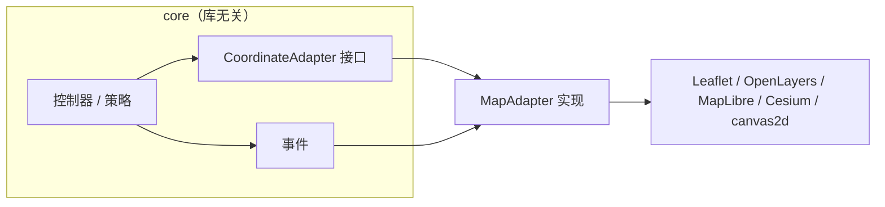

前端通用交互式几何编辑器的设计法则 6 - 配套设施与工程化

# 本篇简述

本篇补全支撑核心机制的配套设施：样式规范、多库适配、元素仓库与坐标适配、日志、光标、热键，以及代码工程化的落地要点。

前几篇讲的是骨架与核心机制。这一篇补上支撑它们运转的“配套设施”：样式怎么规范、多库怎么适配、数据仓库与坐标怎么定、日志与光标怎么接，以及代码工程化怎么落地。

# 1. 样式规范的设计

样式是元素数据的一部分（可序列化、可快照），并且是**实例级**的：每个元素可各自配置基础样式与悬停 / 选中 / 编辑反馈样式，外观类的 `styles` 只是全局默认兜底。规范先行，避免每个库一套写法：**字段不必每个都带**——未提供的字段由适配层取默认值（如线默认实线、无箭头、opacity 1），不同库能支持的字段不同，缺省即可；命名与字段也可按需增减，不必全量对齐。

**颜色一律 cssHexString（如 `'#ff8c00'`），透明度一律 0~1 单独表达**（不鼓励 `#rrggbbaa` 混用透明度）。

```ts
type ColorHex = string;   // css hex，如 '#ff8c00'；透明度一律用 opacity，不用 alpha 十六进制

interface LineStyle {              // 线
  color: ColorHex;
  opacity: number;                 // 0~1
  width: number;                   // 像素
  cap?: 'butt' | 'round' | 'square';
  join?: 'miter' | 'round' | 'bevel';
  dash?: number[];                 // 虚线，如 [8, 4]
  dashOffset?: number;
  arrow?: 'none' | 'start' | 'end' | 'both';   // 箭头（特定库支持）
}

interface FillStyle {              // 面
  color: ColorHex;
  opacity: number;                 // 0~1
  pattern?: string;                // 图案填充（可选）
}

interface SymbolStyle {            // 符号 / 图标
  icon?: string;                   // url / data-uri / 库自带名
  iconSize?: number;
  opacity: number;                 // 0~1
  rotation?: number;               // 弧度
}

interface LabelStyle {             // 文字
  text: string;
  color: ColorHex;
  opacity: number;                 // 0~1
  fontSize: number;
  fontFamily?: string;
  offset?: [number, number];       // 像素偏移
  anchor?: 'top' | 'bottom' | 'center' | 'left' | 'right';
}
```

**组合规则**：立体元素（prism / cylinder / mesh）= `line`（轮廓）+ `fill`（面）组合；点状元素（marker / label / billboard）= `symbol` / `label`。

**扩展入口**：保留 `customShaders` 给高级二次开发——不要求每种样式库都支持，适配层对不支持的项**忽略并告警**，而不是报错。

```ts
interface ElementStyle {
  line?: LineStyle;
  fill?: FillStyle;
  symbol?: SymbolStyle;
  label?: LabelStyle;
  customShaders?: Record<string, ShaderSlot>;   // 自定义着色器入口
}

interface ShaderSlot {
  kind: 'builtin' | 'custom';
  source?: string;                 // GLSL / 地图库着色器代码
  uniforms?: Record<string, unknown>;
  defines?: Record<string, string | number | boolean>;
}
```

# 2. 多库适配处理

“库无关”不是抽象，而是靠适配器这一层物理隔离。适配器在四个环节被使用：

| 环节 | 适配器承担 |
| --- | --- |
| 输入 | 订阅库事件 / 原生 DOM，产出 `leftdown / mousemove` 等 |
| 坐标 | 实现 `CoordinateAdapter`（`worldToScreen / screenToWorld`） |
| 渲染 | `render / updateElement / removeElement`，把 Element 翻译为库对象 |
| 拾取 | `hitTest`，返回 `elementId` |

装配二选一：按 `host` 类型自动识别，或宿主显式注入 `{ adapter: new CesiumMapAdapter() }`。



**单库集成**：若只针对某个地图库，可放弃适配器，直接在 Element 里承载库类型（如 Cesium `Primitive` / `LabelCollection`）——适配器不是必须，库无关才是目标。

| 关注点 | Leaflet | OpenLayers | MapLibre | Cesium |
| --- | --- | --- | --- | --- |
| 屏幕→世界 | containerPointToLatLng | getCoordinateFromPixel | unproject + queryTerrainElevation | pickPosition |
| 世界→屏幕 | latLngToContainerPoint | getPixelFromCoordinate | project | SceneTransforms.worldToWindowCoordinates |
| 命中 | 自算容器像素距离 | forEachFeatureAtPixel | queryRenderedFeatures | pick |

# 3. 元素仓库与坐标适配

**ElementStore** 是可选但推荐的管理 / 查询接口：缓存 `count()` / `bounds()` 等统计量（随变更增量维护），元素量大时用 `Map<id, Element>` + 空间索引补查找。

```ts
interface ElementStore {
  add(element: Element): void;
  remove(id: string): boolean;
  update(id: string, partial: Partial<Element>): Element;
  get(id: string): Element | undefined;

  findById(id: string): Element | undefined;
  search(geo: QueryGeometry, opts?: SearchOptions): Element[];   // 点 / 线 / 面空间查询
  count(): number;                       // 总数（缓存）
  bounds(): Bounds | null;               // 总范围（缓存）
}
```

**坐标适配**几条约定：

- 世界坐标与模型统一存 **float64（双精度）**，屏幕计算中间过程用 float64，仅 GPU 提交用 float32；
- 坐标比较一律用**容差**，禁止 `===`：世界坐标 `< 1e-9`，屏幕坐标 `< 0.5px`；
- 3D 里一个屏幕点对应一条射线，`screenToWorld` 需要“射线与平面 / 地形求交”的能力；拖顶点时**固定参考高程**避免视角抖动。

# 4. 日志适配

编辑器内部逻辑管线很多（命中、策略流转、仲裁转移、精确编辑、同步链路），没有日志几乎没法排查。约定一个接口 + 默认实现：

```ts
interface LogAdapter {
  debug(scope: string, message: string, data?: unknown): void;
  info(scope: string, message: string, data?: unknown): void;
  warn(scope: string, message: string, data?: unknown): void;
  error(scope: string, message: string, data?: unknown): void;
}

const duck = new Facade(host, { logger: myLogger });   // 未注入则用 console 默认实现
// duck 是什么？你别管，你封装什么它是什么——也可能是 cat
```

约定：高频事件（mousemove 逐帧）不打日志，只在**状态变迁处**打；坐标等敏感数据可截断。

# 5. 光标管理器

光标随交互阶段变化，用三层优先级避免互相覆盖：

**瞬时（悬停 / 热键按下 / 鼠标按下）> 状态（进入编辑 / 绘制）> 空闲（默认）**

```ts
duck.cursor.apply('idle', 'default');           // 空闲
duck.cursor.apply('state', 'crosshair');        // 进入绘制
duck.cursor.apply('transient', 'grab');         // 悬停可编辑元素
duck.cursor.apply('transient', 'grabbing');     // 按住拖拽
duck.cursor.reset();                            // 移出 / 松开：回 idle
```

移出即回落，让“谁最近碰过鼠标”说了算。

# 6. 键盘热键管理器

第 2 篇讲过：热键被设计成**上下文类**注入策略对象，而不是广播给所有人。这里补充它的可配置面：

```ts
interface HotkeyOptions {
  target?: HTMLElement;          // 键盘监听目标，缺省 window
  enabled?: boolean;
}

// 策略侧订阅（绘制 / 编辑策略通用）
onHotkey(h: HotkeyManager): void {
  if (h.isDown('ShiftLeft')) this.snap = true;
  if (h.isDown('Backspace')) this.removeLastPoint();
  if (h.isDown('Escape')) this.cancel();
}
```

语义随模式变化（绘制时 Backspace 删点、编辑时删选中顶点）由策略决定，管理器只做状态分发。

# 7. 代码工程化设计

产物是库，验收标准是**可运行**：

- TypeScript `strict` 编译零错误，公开 API 全写 JSDoc / TSDoc；
- 核心逻辑（坐标换算、状态变换、命中、策略流转）有单元测试，core 测试不依赖真实地图库（mock 坐标适配器即可）；
- 附可运行 demo，至少走通“绘制 → 编辑”闭环——demo 是验收的一部分，不只是演示。

分库分发时建议 monorepo，demo 与包分开：

```
apps/demo
packages/core
packages/adapter-leaflet
packages/adapter-maplibre
packages/transformers
packages/transformers-adapters
```

工具链不绑定单一运行时（npm / pnpm / yarn / bun 均可），`exports` 可按需提供 `"bun"` 条件；地图库作为 `peerDependencies`（版本归宿主），core 尽量零运行时依赖。

# 8. 小结与“何时不必”

配套设施的价值在于“**把约定写进结构**”：样式规范让渲染统一，日志适配让问题可查，光标三层让体验可控，工程化让产物可交付。它们大多是**可选**的——原型阶段可以全不接；一旦要“长期维护、被集成、跨库跑”，这一篇的每一项都值得按需点亮。
