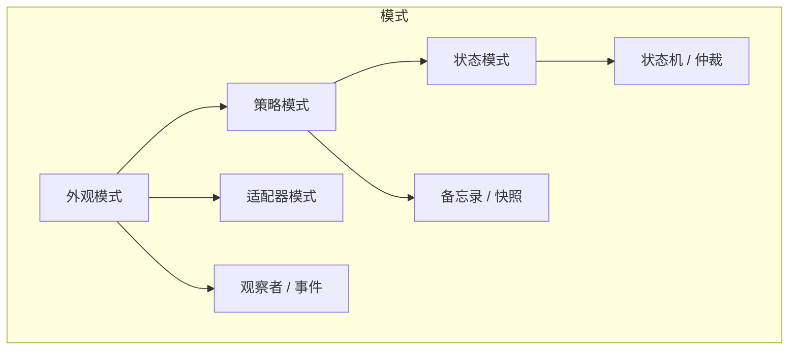

前端通用交互式几何编辑器的设计法则 7 - 设计模式与原则

# 本篇简述

本篇从代码工程角度出发，讲述用到的设计模式和设计原则。

前面六篇各讲一个模块，这一篇把它们收束成“模式与原则”，看看这套设计背后有哪些规律可循。

# 1. 模式一览

## 1.1 外观模式（Facade）

**用在哪儿**：`Facade` 外观对象（第 1 篇）。

宿主只面对一个门面，装配、输入注入、事件出口、双入口全部收敛在门后。换地图库 = 换适配器，宿主代码不动。

## 1.2 策略模式（Strategy）

**用在哪儿**：`IDrawStrategy` / `IModifyStrategy`（第 4 篇）。

绘制 / 变更能力可插拔。新增一种几何，写一个新策略实现接口，容器与其它控制器不动。策略接口把“行为”从“容器”里抽出来，是扩展性的第一来源。

## 1.3 状态模式（State）

**用在哪儿**：策略内部 `idle / placing / dragging`（第 4 篇）。

同一个 `onLeftDown` 在不同状态下做不同的事，状态自管迁移。它让“事件的处理规则”从“一长串 if”变成“清晰的子状态”，可测试性随之而来。

## 1.4 适配器模式（Adapter）

**用在哪儿**：`MapAdapter` / `CoordinateAdapter`（第 1 篇）。

库无关的边界。core 不认识任何地图库，适配器负责把 core 翻译成具体库的渲染与拾取，把库事件翻译回 core 指令。适配器是“换库”发生的唯一地点。

## 1.5 观察者 / 事件（Observer）

**用在哪儿**：事件系统 + `EditorEvents` 目录（第 2 篇）。

阶段对外通信、UI 联动、组件解耦，全靠事件。目录先登记再实现，防止事件名漂移。

## 1.6 备忘录 / 快照（Memento, not Command）

**用在哪儿**：`getState / setState`（第 3 篇）。

撤销 / 重做不靠命令栈，靠**数据快照**回放——这本质就是**备忘录模式（Memento）**：快照即备忘录，`getState()` 创建备忘录、`setState()` 从备忘录恢复，宿主扮演 Caretaker（保存与回放历史）。这是对命令模式（Command）的一种**主动放弃**：命令模式适合要精确控制每一步的场合，而这里“状态即数据”让历史归宿主，库更薄。

## 1.7 状态机 / 仲裁（StateMachine）

**用在哪儿**：`StateArbiter`（第 4 篇）。

竞态仲裁：一个时刻只有一个活动消费者。所有输入先问仲裁器，拿到允许才继续。

# 2. 原则一览

**接口优先，组合优于继承。** 用 `Hoverable / Editable` 标记接口约束“能力”，用策略接口约束“行为”，class 通过实现 + 组合获得能力，而不是继承一个不断膨胀的基类。组合的代价是装配关系要有人管理——这个“人”就是外观类。

**依赖单向，分层收敛。** 宿主 → 外观类 → 控制器 → core → 适配器。core 永远不知道地图库的存在；适配器是“库无关”的边界。这条原则比任何一条都更接近本系列的“工程美学”：改动总在一层内发生。

**单一职责，角色分明。** 鼠标管家只管分发，拾取器只出命中不裁决，辅助图形不感知几何算法、策略不感知图形表现。每个角色的职责边界是“能不能被替换”的度量。

**状态即数据，历史归宿主。** 库不维护历史，元素不带交互状态；快照是数据层与行为层之间的契约。

**扩展点显式化。** 自定义取点模式（`PickMode` 的 `kind: 'custom'` 回调）、自定义着色器（`customShaders`）、自定义变换器样式——凡是“高级二次开发”需要的口子，都显式留出，而不是让调用方去改类库。

# 3. 反模式：不这么设计会怎样

| 常见做法 | 后果 | 本系列的替代 |
| --- | --- | --- |
| 业务判断写进鼠标回调 | 回调膨胀、无法测试、无法替换 | 事件管家只分发，策略消费（第 2、4 篇） |
| 元素上挂选中 / 悬停状态 | 持久化 / 深拷贝 / 撤销全出错 | 元素静态化，行为归交互层（第 3 篇） |
| 所有控制器各自监听鼠标 | 状态机互相打架 | 输入收口 + 仲裁器（第 4 篇） |
| 手柄 / 变换器堆在编辑策略里 | 加一种几何改一次策略 | 抽离编辑辅助角色层（第 5 篇） |
| 直接 import 地图库到处用 | 换库 = 重写 | 适配器守住库无关边界（第 1 篇） |

# 4. 一条主线

如果只能留一句话总结这个系列：**把“谁在消费输入”变成结构上的确定，把“状态”还给数据，把“渲染”交给适配器，把“扩展”留给接口。**

- 输入被收口到事件管家，消费者被仲裁器裁定（第 2、4 篇）；
- 元素是静止的数据对象，快照让撤销 / 重做归宿主（第 3 篇）；
- 外观对象是唯一门面，适配器守住库无关边界（第 1 篇）；
- 辅助图形与变换器成为可插拔的角色层，扩展性从结构中来（第 5 篇）。

# 5. 何时不必，与总结

这套设计是为“**要长期维护、要被人集成、要在多套地图库上跑**”的库准备的。如果你的场景只是一次性原型、固定几个图形、单机单库，可以直接跳过大部分：跳过仲裁（没有多模式竞争）、跳过快照（不需要撤销 / 持久化）、跳过辅助角色层（不需要二次开发）。好的设计不是处处用满，而是**懂得在不需要的地方停手**。

最后回到出发点：市面上的地图编辑工具，要么和界面深度绑定、要么绑死单一库、要么功能堆叠难以维护——它们缺的不是功能，而是一种“边界清晰、依赖单向、可组合、可替换、可长期维护”的工程美学。本系列提供的不是唯一答案，而是一套经过多年编辑功能开发踩坑验证的取舍框架。

愿这些经验，能帮到还在为“编辑器怎么被集成”发愁的同行。系列完。
